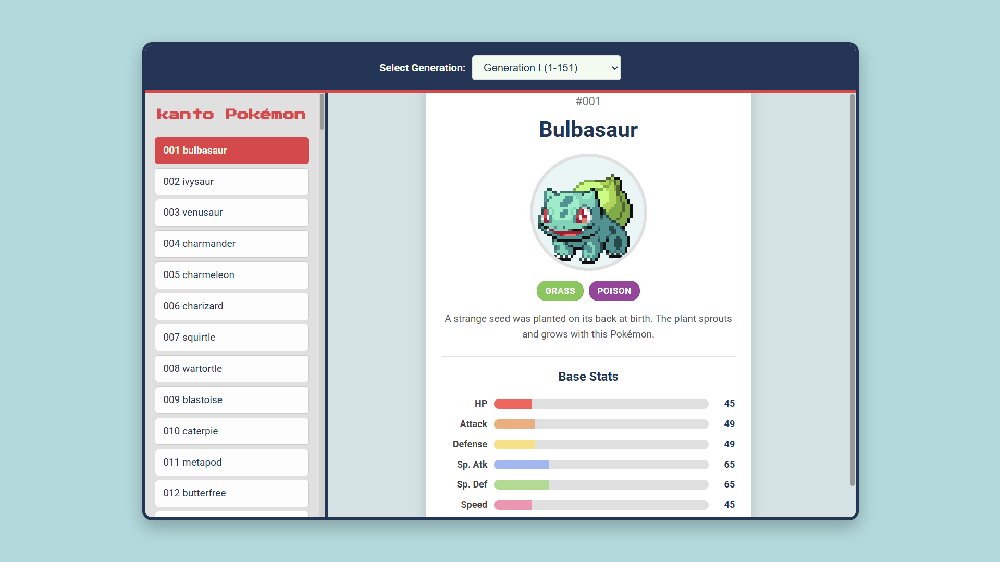

# Interactive Web Pokédex

A responsive web application that allows users to browse Pokémon information, fetched dynamically from the PokéAPI. Users can select a specific Pokémon generation and view details including stats, types, descriptions, and animated sprites.

## Screenshot

## Features

* **Dynamic Data:** Fetches Pokémon data in real-time from the [PokéAPI (v2)](https://pokeapi.co/).
* **Generation Selector:** Browse Pokémon from specific generations (I - IX currently supported) using a dropdown menu.
* **Detailed View:** Displays key information for each selected Pokémon:
    * National Pokédex Number
    * Name (Properly Capitalized)
    * Animated Sprite (Gen 5 Style, falls back to other sprites if unavailable)
    * Type(s) with corresponding color badges
    * Pokédex Description (flavor text from games)
    * Base Stats (HP, Attack, Defense, Sp. Atk, Sp. Def, Speed) with visual progress bars.
* **Interactive List:** Dynamically updates the Pokémon list based on the selected generation, sorted by Pokédex number.
* **Smooth Transitions:** Subtle fade animations when switching between Pokémon views.
* **Responsive Design:** Adapts layout for various screen sizes, from mobile devices to desktops.

## Technologies Used

* **HTML5:** For structuring the web page.
* **CSS3:** For styling, layout (Flexbox), transitions, and responsiveness (Media Queries).
* **JavaScript (Vanilla):** For DOM manipulation, API interaction (`Workspace`), event handling, and dynamic content updates.
* **PokéAPI (v2):** As the source for all Pokémon data.

## Setup and Installation

This project is purely client-side and requires no complex build steps or server setup.

1.  **Get the Files:** Clone the repository or download the project files (`index.html`, `style.css`, `script.js`).
2.  **Ensure Files are Together:** Place all three files (`index.html`, `style.css`, `script.js`) in the same directory/folder.
3.  **Open:** Open the `index.html` file directly in your preferred modern web browser (e.g., Chrome, Firefox, Edge, Safari).

## Usage

1.  **Internet Connection:** An active internet connection is required the first time you load a generation or view a Pokémon, as the application needs to fetch data from PokéAPI.
2.  **Select Generation:** Use the dropdown menu at the top to choose the Pokémon generation you want to browse. The list will automatically update.
3.  **Select Pokémon:** Click on a Pokémon's name in the list on the left side.
4.  **View Details:** The details for the selected Pokémon will appear in the main display area on the right.

## Potential Future Improvements

* **Search/Filter:** Implement a search bar to filter Pokémon within the selected generation by name or number.
* **Evolution Chain:** Display the evolution chain for the selected Pokémon.
* **Type Weaknesses/Resistances:** Show type matchups (weaknesses, resistances, immunities).
* **Caching:** Implement `localStorage` caching to reduce API calls and allow for limited offline viewing after initial fetch.
* **Sounds:** Add Pokémon cries on selection.
* **Alternate Forms:** Add support for viewing different forms (Mega, Alolan, Galarian, Hisuian, Paldean, etc.).
* **Loading Indicators:** More refined loading states for API calls.
* **Pagination:** For very large lists (though generations are manageable currently).

## Acknowledgements

* This project relies heavily on the fantastic and free **[PokéAPI](https://pokeapi.co/)** for all Pokémon data and sprites.

